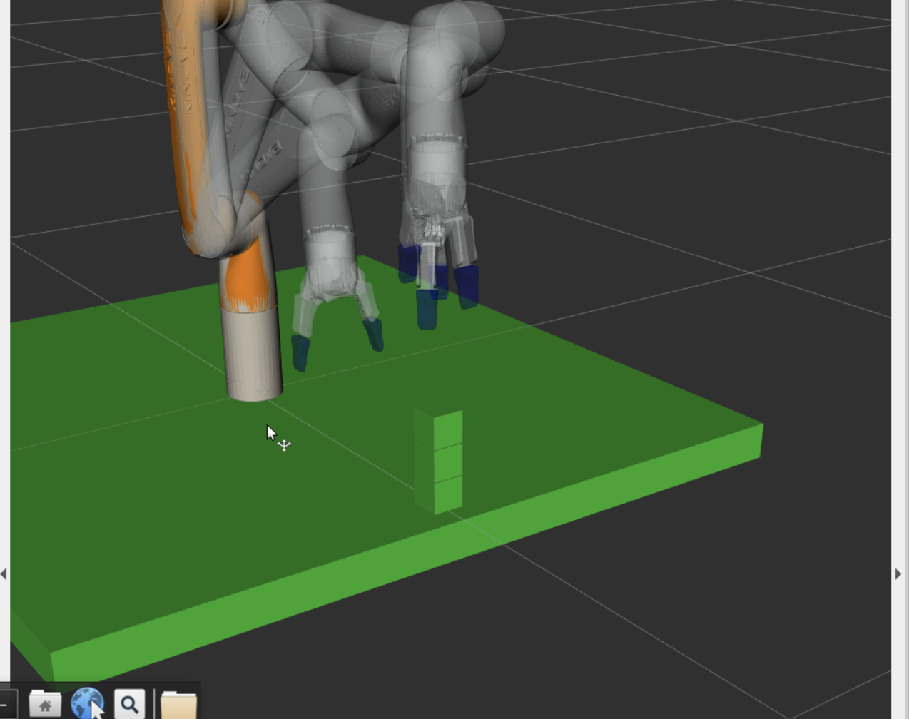
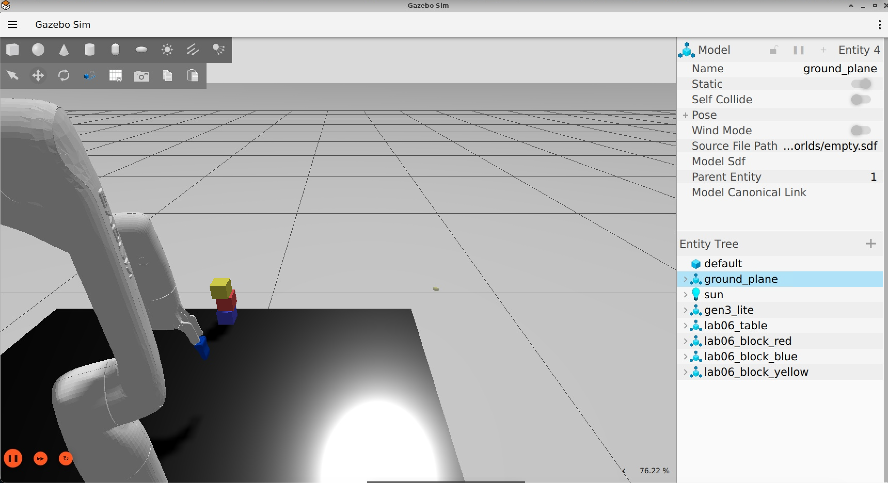
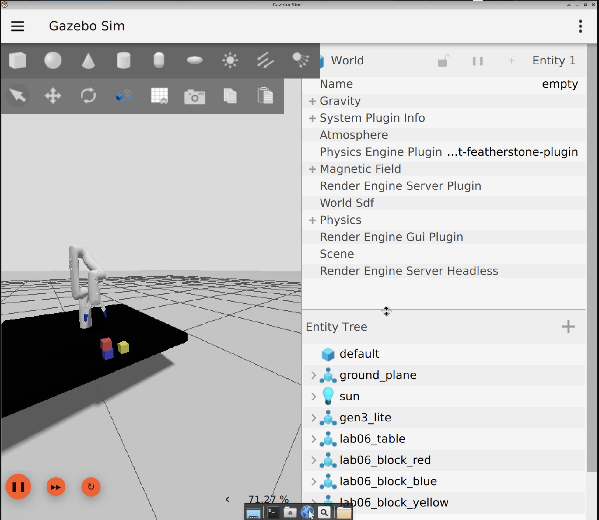

# Pick & Place with Kinova Gen3 Lite



## Overview
This repository contains the ROS 2 workspace I used to teach the Kinova Gen3 Lite arm to pick three 40 mm blocks and stack them into a stable tower. The setup uses Gazebo, MoveIt 2, and the official Kinova packages. A custom `pick_and_place.py` node (under `ros2_ws/src/moveit/moveit/scripts/`) coordinates the sequencing, gripper control, and planning-scene updates.

### Highlights
- Full ROS 2 Humble workspace with MoveIt 2 configuration for the Gen3 Lite arm and gripper.
- Task-oriented interface: `home`, `retract`, `add_scene`, `pick_place_one`, and `stack` are all invokable via `ros2 run` parameters.
- Carefully tuned grasp and placement poses that produce a reliable three-block stack in both Gazebo and RViz.
- Utility script (`spawn_blocks.sh`) and documentation screenshots to simplify debugging and to clearly demonstrate results.

## Repository Layout
```text
.
├── docs/                      # Screenshots and diagrams used in the report
├── ros2_ws/
│   ├── src/
│   │   ├── moveit/            # moveit package (pymoveit2 script + setup files)
│   │   └── mems-toolkit/      # Provided course utilities
│   └── ...                    # Build/install folders are generated by colcon
└── README.md


## Prerequisites
- Ubuntu 22.04 with ROS 2 Humble (Desktop or Desktop-Full) and the Kinova Kortex packages.
- Gazebo Sim (Fortress/Garden) so the `gz sim` and `gz service` CLI tools are available.
- MoveIt 2, `pymoveit2`, and standard ROS 2 build tools (`colcon`, `rosdep`).
- A working ROS 2 overlay sourced before building/running (`/opt/ros/humble/setup.bash`).

Install any missing packages via `apt`:
```bash
sudo apt update
sudo apt install python3-colcon-common-extensions ros-humble-moveit \
  ros-humble-kortex-description ros-humble-kortex-gazebo ros-humble-pymoveit2 \
  ros-humble-gazebo-ros-pkgs gz-sim
```

## Workspace Setup
```bash
# Clone / download this repo, then:
cd kinovaGen3-Pick-and-Place/ros2_ws
source /opt/ros/humble/setup.bash
rosdep install --from-paths src --ignore-src -r -y
colcon build --symlink-install
source install/setup.bash
```
Run the final `source install/setup.bash` (or `source install/local_setup.bash`) in every terminal that interacts with the workspace.

## Quick Start: 3-Block Stack Demo
> The commands below assume you already built the workspace and sourced both the ROS 2 underlay and the `ros2_ws/install` overlay in each terminal.

1. **Terminal A — Gazebo + robot controllers**  
   ```bash
   ros2 launch kortex_gazebo spawn_kortex_robot.launch.py robot_type:=gen3_lite
   ```
   This starts Gazebo, loads the Kinova robot model, and brings up the controllers.

2. **Terminal B — MoveIt 2**  
   ```bash
   ros2 launch kortex_move_it_config kortex_move_it_demo.launch.py
   ```
   This launches RViz with the MoveIt 2 demo configuration so you can visualize planning and collisions.

3. **Terminal C — Populate the planning scene**  
   ```bash
   cd ~/workspaces/ms1242_robotics_fall2025/lab06/ros2_ws
   source install/setup.bash
   ros2 run lab06_moveit pick_and_place --ros-args -p task:=add_scene
   ```
   The `add_scene` task inserts the table and three cubes so MoveIt understands the environment.

4. **Terminal D — Run the stacking routine**  
   ```bash
   cd ~/workspaces/ms1242_robotics_fall2025/lab06/ros2_ws
   source install/setup.bash
   ros2 run lab06_moveit pick_and_place --ros-args -p task:=stack
   ```
   The node calls `task_stack_all()` which sequentially places block 1 onto block 2, then block 3 on top, pausing long enough for Gazebo physics to settle between grasps/releases.

### Available Tasks
| Parameter (`task:=…`) | Description |
| --- | --- |
| `home` | Move the arm to the home joint configuration (see `j_home`). |
| `retract` | Move to the safer observation pose used between operations (`j_retract`). |
| `add_scene` | Adds the table and three collision objects to the MoveIt planning scene. |
| `pick_place_one` | Demonstrates a single pick-place cycle that returns the cube to its starting spot. |
| `stack` | Executes `task_stack_all()` to build the three-block tower. |

Run any task with `ros2 run lab06_moveit pick_and_place --ros-args -p task:=<name>` from a sourced workspace terminal.

## Customization Notes
- **Poses & grasp logic:** Edit `ros2_ws/src/moveit/moveit/scripts/pick_and_place.py` to change block locations (`self.blocks_xyz`), approach heights, or the stacking order.
- **Gazebo scene:** If you want to spawn standalone blocks directly in Gazebo, execute `ros2_ws/src/moveit/moveit/scripts/spawn_blocks.sh`. The script exposes environment variables (`BLOCK_SIZE`, `BLOCK_MASS`, `SPACING`, etc.) for rapid experimentation.
- **Visuals:** Screenshots stored in `docs/` are referenced in this README. Add new captures there and link them using Markdown (e.g., ``).

## Troubleshooting
- Make sure every terminal sources both `/opt/ros/humble/setup.bash` and `ros2_ws/install/setup.bash`. Missing environment variables are the most common cause of `package not found` or `action server unavailable` errors.
- If MoveIt reports planning failures, rerun the `add_scene` task to re-sync collision objects, or restart Gazebo so the physics engine resets block poses.
- The gripper controller occasionally ignores back-to-back goals. The script already waits a short period after opening/closing, but you can increase the `time.sleep` values in `task_stack_all()` for a more relaxed cadence.
- When Gazebo performance drops, disable RViz rendering or launch Gazebo headless (`gz sim -s`) and use RViz only for visualization.

## Results
- 
- 
- 

## Physical Implementation 

https://github.com/user-attachments/assets/ea78ddbb-0a0a-45a7-a6db-c9a45dc59d8b


